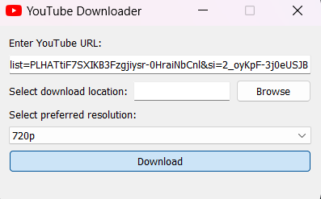

# YouTube Video and Playlist Downloader

## Introduction

This Python application allows users to download YouTube videos and playlists effortlessly using the Pytube library for handling YouTube API interactions and PyQt5 for creating a user-friendly graphical interface.

## Features

- Download individual YouTube videos.
- Download entire YouTube playlists with a single click.
- Intuitive and user-friendly graphical interface.
- Option to choose download quality and format.
- Fast and reliable downloads.

## Prerequisites

Before using the application, make sure you have the following dependencies installed:

- Python 3.x
- Pytube library
- PyQt5 library

You can install the required libraries using the following commands:

```bash
pip install pytube
pip install PyQt5
```

## How to Use

1. Clone or download the repository to your local machine.
2. Open the terminal or command prompt and navigate to the project directory.
3. Run the application by executing the following command:

   ```bash
   python main.py
   ```

## Application Screenshots


*Figure 1: Application Main Window*

## User Guide

1. **Video Download:**
   - Paste the URL of the YouTube video in the designated field.
   - Choose the desired video quality and format.
   - Click the "Download" button to start the download.

2. **Playlist Download:**
   - Paste the URL of the YouTube playlist in the designated field.
   - Choose the desired video quality and format.
   - Click the "Download Playlist" button to start downloading the entire playlist.

3. **Settings:**
   - Access the settings menu to customize download preferences.

## Contributions

Contributions are welcome! If you encounter any issues or have suggestions for improvements, feel free to open an issue or create a pull request.

## License

This YouTube Video and Playlist Downloader is licensed under the MIT License - see the [LICENSE](LICENSE) file for details.
